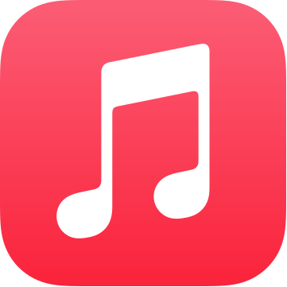

<!--
*** Thanks for checking out the Best-README-Template. If you have a suggestion
*** that would make this better, please fork the repo and create a pull request
*** or simply open an issue with the tag "enhancement".
*** Thanks again! Now go create something AMAZING! :D
***
***
***
*** To avoid retyping too much info. Do a search and replace for the following:
-->

<!-- PROJECT SHIELDS -->
<!--
*** I'm using markdown "reference style" links for readability.
*** Reference links are enclosed in brackets [ ] instead of parentheses ( ).
*** See the bottom of this document for the declaration of the reference variables
*** for contributors-url, forks-url, etc. This is an optional, concise syntax you may use.
*** https://www.markdownguide.org/basic-syntax/#reference-style-links
-->

[![Contributors][contributors-shield]][contributors-url]
[![Forks][forks-shield]][forks-url]
[![Stargazers][stars-shield]][stars-url]
[![Issues][issues-shield]][issues-url]
[![MIT License][license-shield]][license-url]

<!-- PROJECT LOGO -->
<br />
<p align="center">
  <a href="https://github.com/AB-Law/Apple-Discord-Rich-Presence">
    
  </a>

  <h3 align="center">Discord Apple Music Rich Presence Client</h3>

  <p align="center">
    I made this so as to show what music I was playing on Discord. Spotify has an in-built integration with Discord, so I wanted to build a somewhat similar integration, at least one in which you could see what I was listening to at the time.
    <br />
    <a href="https://github.com/AB-Law/Apple-Discord-Rich-Presence"><strong>Explore the docs »</strong></a>
    <br />
    <br />
    <a href="https://github.com/AB-Law/Apple-Discord-Rich-Presence">View Demo</a>
    ·
    <a href="https://github.com/AB-Law/Apple-Discord-Rich-Presence/issues">Report Bug</a>
    ·
    <a href="https://github.com/AB-Law/Apple-Discord-Rich-Presence/issues">Request Feature</a>
  </p>
</p>

<!-- TABLE OF CONTENTS -->
<details open="open">
  <summary><h2 style="display: inline-block">Table of Contents</h2></summary>
  <ol>
    <li>
      <a href="#about-the-project">About The Project</a>
      <ul>
        <li><a href="#built-with">Built With</a></li>
      </ul>
    </li>
    <li>
      <a href="#getting-started">Getting Started</a>
      <ul>
        <li><a href="#prerequisites">Prerequisites</a></li>
        <li><a href="#installation">Installation</a></li>
      </ul>
    </li>
    <li><a href="#usage">Usage</a></li>
    <li><a href="#roadmap">Roadmap</a></li>
    <li><a href="#contributing">Contributing</a></li>
    <li><a href="#license">License</a></li>
    <li><a href="#contact">Contact</a></li>
    <li><a href="#acknowledgements">Acknowledgements</a></li>
  </ol>
</details>

<!-- ABOUT THE PROJECT -->

## About The Project

<!--[![Product Name Screen Shot][product-screenshot]](https://example.com) -->

I made this so as to show what music I was playing on Discord. Spotify has an in-built integration with Discord, so I wanted to build a somewhat similar integration, at least one in which you could see what I was listening to at the time.

### Built With

- [Python](https://www.python.org)
- [Discord Rich Presence](https://discord.com/rich-presence)
- [AppleScript](https://developer.apple.com/library/archive/documentation/AppleScript/Conceptual/AppleScriptLangGuide/introduction/ASLR_intro.html)
- [Apple Music](https://music.apple.com/us/browse)

<!-- GETTING STARTED -->

### Prerequisites

This is an example of how to list things you need to use the software and how to install them.

- Python 3
- Apple Music App on a compatible OS (macOS 10.15+)
- Discord Client

### Installation

1. Clone the repo
   ```sh
   git clone https://github.com/AB-Law/Apple-Discord-Rich-Presence.git
   ```
2. Install the requirements file
   ```sh
    pip install -r requirements.txt
   ```

<!-- USAGE EXAMPLES -->

## Usage

Open Discord and the Music App
To use the python file, open the terminal, navigate to the location where the repo was cloned and then type

```sh
    python3 discord-apple_music
```

<!-- ROADMAP -->

## Roadmap

See the [open issues](https://github.com/AB-Law/Apple-Discord-Rich-Presence/issues) for a list of proposed features (and known issues).

<!-- CONTRIBUTING -->

## Contributing

Contributions are what make the open source community such an amazing place to be learn, inspire, and create. Any contributions you make are **greatly appreciated**.

1. Fork the Project
2. Create your Feature Branch (`git checkout -b feature/AmazingFeature`)
3. Commit your Changes (`git commit -m 'Add some AmazingFeature'`)
4. Push to the Branch (`git push origin feature/AmazingFeature`)
5. Open a Pull Request

<!-- LICENSE -->

## License

Distributed under the MIT License. See `LICENSE` for more information.

<!-- CONTACT -->

## Contact

Akshay B - [@Akshay_Law](https://twitter.com/Akshay_Law) - akshay.law35@gmail.com
Discord - A Law#7777
Project Link: [https://github.com/AB-Law/Apple-Discord-Rich-Presence](https://github.com/AB-Law/Apple-Discord-Rich-Presence)

<!-- ACKNOWLEDGEMENTS -->

## Acknowledgements

- [NextFire](https://github.com/NextFire/apple-music-discord-rpc)
- [Best-README-Template](https://github.com/othneildrew/Best-README-Template)

<!-- MARKDOWN LINKS & IMAGES -->
<!-- https://www.markdownguide.org/basic-syntax/#reference-style-links -->

[contributors-shield]: https://img.shields.io/github/contributors/AB-Law/Apple-Discord-Rich-Presence.svg?style=for-the-badge
[contributors-url]: https://github.com/AB-Law/Apple-Discord-Rich-Presence/graphs/contributors
[forks-shield]: https://img.shields.io/github/forks/AB-Law/Apple-Discord-Rich-Presence.svg?style=for-the-badge
[forks-url]: https://github.com/AB-Law/Apple-Discord-Rich-Presence/network/members
[stars-shield]: https://img.shields.io/github/stars/AB-Law/Apple-Discord-Rich-Presence.svg?style=for-the-badge
[stars-url]: https://github.com/AB-Law/Apple-Discord-Rich-Presence/stargazers
[issues-shield]: https://img.shields.io/github/issues/AB-Law/Apple-Discord-Rich-Presence.svg?style=for-the-badge
[issues-url]: https://github.com/AB-Law/Apple-Discord-Rich-Presence/issues
[license-shield]: https://img.shields.io/github/license/AB-Law/Apple-Discord-Rich-Presence.svg?style=for-the-badge
[license-url]: https://github.com/AB-Law/Apple-Discord-Rich-Presence/blob/master/LICENSE.txt
